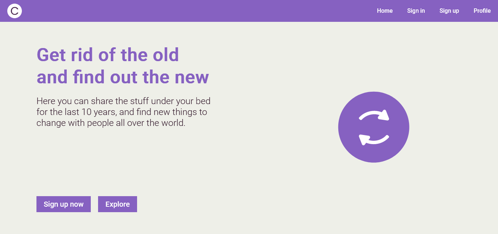

<div align="center">


# Changix


:star: Star me on GitHub!
</div>

## Overview

The idea of changix is to offer a place where people can
share their stuff, and look for somebody who also wants to exchange things,
giving a user-friendly interface, making things as simple as possible.

## Table of contents

- [Screenshots](#screenshots)
- [Progress](#progress)
  - [Pages](#pages)
  - [Components](#components)
  - [API Routes](#api-routes)
- [Packages](#packages)
- [Contributing](#contributing)
- [Useful links](#useful-links)
- [Author](#author)

## Screenshots

[(Back to top)](#table-of-contents)

- ### Landing page


## Progress

[(Back to top)](#table-of-contents)

- ### Pages
  - [x] Landing
  - [x] Home
  - [x] Sign up
  - [x] Sign in
  - [x] Forgot password
  - [x] Profile
  - [x] Item
  - [x] Announce Item

- ### Services
  - [x] Authentication
  - [x] Media storage
  - [x] Content storage (about users and announced items)

## Packages

[(Back to top)](#table-of-contents)

- [Firebase](https://www.npmjs.com/package/firebase)
- [Lottie React](https://github.com/Gamote/lottie-react)
- [Font Awesome Icons](https://fontawesome.com/docs/web/use-with/react/)
- [Sharp](https://sharp.pixelplumbing.com)
- [React Responsive Carousel](https://www.npmjs.com/package/react-responsive-carousel)
- [React Hook Form](https://react-hook-form.com)
- [React Phone Number Input](https://www.npmjs.com/package/uuid)
- [uuid](https://www.npmjs.com/package/uuid)

## Contributing

[(Back to top)](#table-of-contents)

```
    >> Fork this repository

    >> Clone the repository to your local system
    git clone https://github.com/athityakumar/colorls

    >> Create a new branch containing your feature
    git checkout -b feature

    >> Commit your changes
    git commit -m "new feature"

    >> Push to your branch
    git push origin feature

    >> Once you push your changes, click the compare && pull request button in your github

    >> Click the create pull request button

    >> After your pull request's merge has been done, you can delete your branch
```

## Useful links

[(Back to top)](#table-of-contents)

- [File converter](https://cloudconvert.com)
- [Logo maker](https://howtostartanllc.com/logo-maker/)
- [Regex cheat sheet](https://cheatography.com/davechild/cheat-sheets/regular-expressions/)
- [Image previewer](https://developer.mozilla.org/en-US/docs/Web/API/FileReader/readAsDataURL)

## Author

[(Back to top)](#table-of-contents)

- [LinkedIn](https://www.linkedin.com/in/romario-negreiros-8591b6214)
- [Website](https://romario-negreiros.github.io/Romario-frontend/)
- [Frontend Mentor](https://www.frontendmentor.io/profile/Romario-Negreiros)